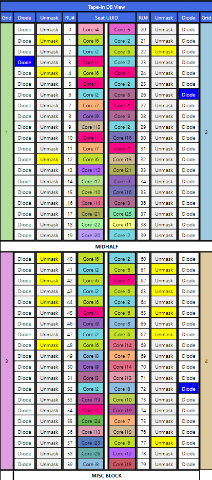

# RU_table_floorplan

## About
This is a full-stack coding assessment project that involves the development of a React application that takes a JSON dataset containing product names and their repetition count, and must use an algorithm to generate a floor plan (RU Table) based on certain constraints. 

## Constraints / Requirements
- “Diode” and “Unmask” columns on both sides of the floor plan grid are interactive. When “Diode” is clicked, the cell should change 
its color to blue. The “Unmask” cell when clicked, causes all cells containing products with the same name within the “Unmask” column should change their color to yellow. (Example: When user clicks on Core i1 Unmask column all respective Core i1 Unmask cells should change to yellow)
- Products on the floor plan must be rendered based on the repetition count, as given in the JSON file input.
- MIDHALF row should be rendered after 20 RUs to create a grid like structure.
- Core i4/i5 products can only be placed in grids 1 and 2.
- No two products can be adjacent to each other. (Example: Core i1 in grid 1 and 
RU#0 cannot be next to another Core i1 in grid 1 RU#1, but can be placed at 
RU#2 in grid 1)

## How was it implemented?
### Algorithm to generate floorplan
1. Create an empty floorplan, i.e. a 4x20 matrix.
2. Parse the JSON input into an array of type Node, containing fields: Product name, original count (the repetition count from the JSON), current count (the remaining count after placement in a cell of floorplan).
3. First, place all Core i4/i5 products at the starting positions of Grid 1 and 2 in a manner such that the similar products don't appear adjacent. Remove Core i4/i5 products from array generated in step 2.
4. Now, create a Max-Heap of the array of products not placed in matrix and fill in each cell by polling the Max-Heap (using current count as the criteria for deciding max, if current count is the same, original count serves as the tie-breaker).
5. Finally, fill in every cell of the floorplan matrix (that hasn't already been filled) by polling from the Max-Heap. In case Max-Heap returns a Product used in the previous round of polling, it is not considered and the next product popped from Max-Heap is considered and placed, to ensure there is no adjacency of same products. Placement only happens if the product popped has non-zero current count.

### React frontend logic
- The outer grid-like structure is mimicked by the component `TapeinDBView`.
- Within that component, is 2 types of Grids: `LeftGrid` and `RightGrid`, to mimic the mirror-image structure of grids placed next to each other horizontally.
- Each of the `LeftGrid` and `RightGrid` components placed is provided with props like `gridNumber` and `floorplan` which will help determine the values of the underlying sub-components.
- These sub-components include `DiodeButton`, `UnmaskButton`, `RUNumberComponent` and `ProductComponent`, that are populated per grid according to the floorplan.
- `RUNumberComponent` makes use of `gridNumber` and the current index of cell in the loop through to determine the RU# according to constraints.
- `ProductComponent` makes use of `gridNumber`, floorplan matrix and the current index of cell in the loop through to determine the Product name to be populated in that cell.
- `DiodeButton` simply changes color to Blue when pressed and back to its original color when de-pressed.
- `UnmaskButton` makes use of `useState` hook. When an "Unmask" button is clicked, `setHighlightedValues` is invoked, updating a set of highlighted values with current clicked values. This trigger a re-render of component containing the button and its child components. During the re-render, each unmask button is highlighted in Yellow if the cell's corresponding product name is in the set of highlighted values.

## How to run?
- Clone this project: ```git clone https://github.com/SiddAjriY2Jaccount/RU_table_floorplan```
- From the root directory, navigate into the React app: ```cd table-floorplan-app```
- Install all dependencies: ```npm install```
- Now, start the project using the command: ```npm start```
- The React frontend will open up at `https://localhost:3000`

## Concepts used
- Max-Heap: For optimal construction of floorplan following all constraints.
- React concepts: Props, States, Hooks, Components.

## Contributors
[Siddhanth Jayaraj Ajri](https://github.com/SiddAjriY2Jaccount)

## Screenshots


## Bibliography
Links that were particularly helpful during the development of this project:
- [Maps in Javascript](https://developer.mozilla.org/en-US/docs/Web/JavaScript/Reference/Global_Objects/Map/size)
- [Random, unique color generation](https://stackoverflow.com/questions/5850590/random-color-generator-with-hue-saturation-and-more-controls)
- [JSON parsing](https://akhtarvahid.medium.com/how-to-access-fetch-the-local-json-file-to-react-5ce07c43731d)
- [Tabular grid structures](https://ilovecoding.org/lessons/table-all-about-creating-simple-to-complex-html-tables)
- [React tables](https://medium.com/@alekniukas/create-your-own-react-table-or-grid-components-with-ease-8c30cc054529)
- [Binary heap package in NPM](https://www.npmjs.com/package/heap)